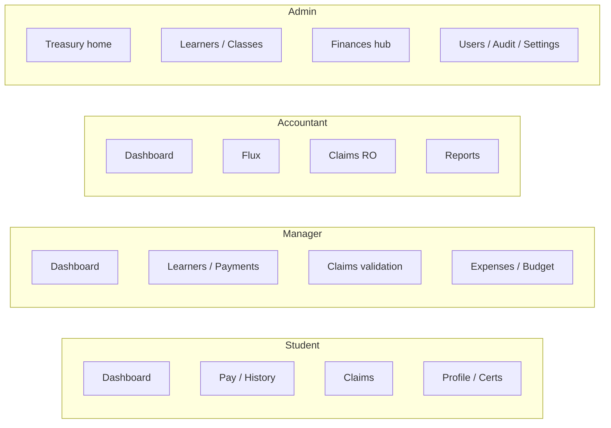

# Glonetz ERP Frontend

A **Next.js 16** single-page application that powers the Glonetz financial and school-management experience. The UI is organized around **four roles**—`admin`, `manager`, `student`, and `accountant`—each with a dedicated navigation shell, dashboards, and feature routes under the App Router.

This document explains **how the repository is structured**, **how to run and build the project**, and **how backend engineers should align HTTP APIs** with the frontend architecture, including a **role × surface map** for integration planning.

---

## Table of contents

1. [Tech stack](#tech-stack)
2. [Repository structure](#repository-structure)
3. [Prerequisites](#prerequisites)
4. [Environment variables](#environment-variables)
5. [Commands](#commands)
6. [Sign-in and demo accounts](#sign-in-and-demo-accounts)
7. [Application architecture](#application-architecture)
8. [Authentication and session](#authentication-and-session)
9. [Mock vs live API](#mock-vs-live-api)
10. [Role-based UI map](#role-based-ui-map)
11. [Backend integration guide](#backend-integration-guide)
12. [HTTP client and errors](#http-client-and-errors)
13. [Further reference](#further-reference)

---

## Tech stack

| Layer | Technology |
| --- | --- |
| Framework | [Next.js](https://nextjs.org) 16 (App Router, React 19) |
| Language | TypeScript |
| Styling | Tailwind CSS 4, `tailwind-merge`, `class-variance-authority` |
| UI primitives | Radix UI–based components under `components/ui/` |
| Forms & validation | `react-hook-form`, `zod` |
| Charts | `recharts` |
| i18n | Custom `services/i18n.ts` + `hooks/use-locale.tsx` |

---

## Repository structure

High-level layout (only the most integration-relevant paths):

```text
app/                          # Next.js App Router
  layout.tsx                  # Root layout (theme, fonts, providers)
  page.tsx                    # Redirects to /login
  login/                      # Public login + PIN flows
  dashboard/
    layout.tsx                # Authenticated shell (sidebar, top bar, mobile nav)
    page.tsx                  # Role-specific home (student / manager / accountant / admin default)
    effectuer-paiement/       # Student: new payment
    mes-paiements/            # Student: payment history
    reclamations/             # Student: claims
    mon-profil/               # Student profile / certificates
    reclamations-validation/  # Admin & manager: validate claims
    manager/                  # Manager-only subtree (learners, expenses, budget, …)
    admin/                    # Admin-only subtree (learners, classes, finances, …)
    comptable/                # Accountant-only subtree (flows, claims RO, reports)

components/                   # Shared UI (dashboards, treasury, navigation, …)
  sidebar-nav.tsx             # Role-driven menu definitions (single source for IA routes)
  ui/                         # Design-system primitives

core/
  api/client.ts               # Fetch wrapper: base URL, Bearer token, JSON/FormData

domains/                      # Domain-driven modules (types + service + providers)
  auth/                       # Login, PIN change, reset helpers
  payments/                   # Student tuition summary & payments
  claims/                     # Student claims + status updates
  certificates/               # Training levels & certificates
  accounting/                 # In-memory mock aggregates (audit-style views)

hooks/                        # React hooks (useAuth, useLocale, admin/manager hooks, …)
lib/                          # PDF helpers, date ranges, utilities
services/                     # Legacy/mock data services (student payments localStorage, admin mocks, i18n)
public/                       # Static assets
types/                        # Shared TS types (e.g. UserRole, LoginResponse)

BACKEND_CONTRACT.md           # Canonical REST contract for wired API domains
docs/payments-api-contract.md # Payments-specific notes and field aliases
```

**Design principle:** UI pages and components should call **`domains/*/service.ts` facades**, not `fetch` directly. HTTP details live in **`domains/*/providers/http.ts`**; offline/demo behavior lives in **`providers/mock.ts`**. This keeps backend URL and payload mapping in one place per domain.

---

## Prerequisites

- **Node.js** 20 LTS or newer (recommended for Next.js 16)
- **npm** (lockfile: `package-lock.json`; `pnpm-lock.yaml` is also present—pick one package manager consistently for your team)

---

## Environment variables

Create a **`.env.local`** file at the project root (never commit secrets). Typical values for calling a local API:

| Variable | Purpose |
| --- | --- |
| `NEXT_PUBLIC_DATA_PROVIDER` | `mock` (default) or `api`. When `api`, auth/payments/claims/certificates use HTTP providers. |
| `NEXT_PUBLIC_API_BASE_URL` | Base URL of the backend **without** trailing slash, e.g. `http://localhost:4000`. Used by `core/api/client.ts`. |

Example:

```env
NEXT_PUBLIC_DATA_PROVIDER=api
NEXT_PUBLIC_API_BASE_URL=http://localhost:4000
```

> **CORS:** The browser calls the API from the Next.js origin. The backend must allow that origin and expose needed headers for authenticated requests.

---

## Commands

| Command | Description |
| --- | --- |
| `npm install` | Install dependencies |
| `npm run dev` | Start the development server (Turbopack). Default URL: [http://localhost:3000](http://localhost:3000) |
| `npm run build` | Production build |
| `npm run start` | Run the production server (after `build`) |
| `npm run lint` | Run ESLint |

---

## Sign-in and demo accounts

### Where to log in

1. Start the app (`npm run dev`) and open **`/login`** (the home route `/` redirects there).
2. Enter a **phone number** and **4-digit PIN**, then submit.

Phone numbers are expected in **E.164** form (e.g. `+237600000000`), consistent with the backend contract in `BACKEND_CONTRACT.md`.

### Demo credentials (mock / development only)

When **`NEXT_PUBLIC_DATA_PROVIDER` is unset or `mock`**, authentication uses fixed accounts defined in `services/auth.service.ts` (`MOCK_ACCOUNTS`). Use these to explore each role:

| Role | Phone | PIN | Notes |
| --- | --- | --- | --- |
| **Admin** | `+237600000000` | `1234` | Lands on the treasury-style dashboard (`TreasuryContent`). |
| **Student** | `+237600000001` | `0000` | **Forced PIN change** after login: you must set a new 4-digit PIN before reaching `/dashboard`. |
| **Manager** | `+237600000002` | `5678` | Manager navigation (learners, payments, expenses, …). |
| **Accountant** | `+237600000003` | `2468` | Accountant navigation (flows, claims, reports, …). |

**Important:** These numbers work only against the **mock** auth provider. They are **not** real users and must **never** be used as production secrets.

**Persistence quirks (mock):**

- PIN overrides (after a successful change) are stored in the browser under the key `glonetz_auth_accounts_v2` in `localStorage`. Clearing site data resets behaviour to the table above.
- The mock **manager PIN SMS** flow (`requestManagerPinSms`) assigns a random 4-digit PIN and logs it to the **browser console** (dev-only).

### Connecting with a real backend (`api` mode)

When **`NEXT_PUBLIC_DATA_PROVIDER=api`**, credentials are **not** taken from `MOCK_ACCOUNTS`. The app calls **`POST /auth/login`** on your API (`NEXT_PUBLIC_API_BASE_URL`). Your server must validate phone + PIN and return JSON including `token`, `role`, and `mustChangePin` as documented in **`BACKEND_CONTRACT.md`**. Use test users created on the backend side (seed data or staging accounts) instead of the table above.

---

## Application architecture

### Routing

- **`/`** → redirects to **`/login`**.
- **`/login`** → phone + PIN authentication; optional forced PIN change.
- **`/dashboard`** and nested routes → protected by `app/dashboard/layout.tsx` (redirects unauthenticated users). The **sidebar** (`components/sidebar-nav.tsx`) defines **which routes appear for which role**.

### Dashboard entry

`app/dashboard/page.tsx` renders one of:

| Role | Component |
| --- | --- |
| `student` | `StudentDashboard` |
| `accountant` | `AccountantDashboard` |
| `manager` | `ManagerDashboard` |
| `admin` (and fallback) | `TreasuryContent` |

### Domain modules

Each domain under `domains/<name>/` typically contains:

- **`types.ts`** — DTOs and enums consumed by the UI
- **`service.ts`** — Public API used by hooks/pages; selects mock vs HTTP provider
- **`providers/http.ts`** — Maps REST endpoints to types (backend integration point)
- **`providers/mock.ts`** — Local demo data

---

## Authentication and session

1. **Login** calls `authService.login` → provider `POST /auth/login` when `NEXT_PUBLIC_DATA_PROVIDER=api`.
2. The response must include at least: `token`, `role` (`admin` \| `manager` \| `student` \| `accountant`), `mustChangePin` (boolean).
3. The session is stored in a cookie **`glonetz_session`** (JSON payload including `token` and `role`).
4. Subsequent API calls send **`Authorization: Bearer <token>`** (see `core/api/client.ts`).

Backend responsibilities:

- Issue a JWT or opaque token the UI can send on every request.
- Return **`401`** for invalid/expired tokens so the client can clear the session and send the user to login.
- Enforce **authorization per role** on every route (the UI hides menus but is not a security boundary).

---

## Mock vs live API

| `NEXT_PUBLIC_DATA_PROVIDER` | Behavior |
| --- | --- |
| `mock` (default) | Auth, payments, claims, certificates use **in-browser mocks** (some student payment state persists in `localStorage`). Admin/manager/accountant screens use **mock services** under `services/` and `domains/accounting/`. |
| `api` | **Auth, payments, claims, certificates** call the backend via `domains/*/providers/http.ts`. Admin/manager/accountant **still rely on mock layers** until corresponding HTTP providers and services are added. |

This split is intentional: the **student financial loop** is the first class of endpoints fully described for HTTP; **operational admin surfaces** are UI-complete but data-backed by mocks today.

---

## Role-based UI map

The following tables tie **roles** to **routes** (as in `sidebar-nav.tsx`) and describe **current backend wiring** for integration planning.

### Student (`student`)

| Route | Purpose |
| --- | --- |
| `/dashboard` | Dashboard |
| `/dashboard/effectuer-paiement` | Create payment |
| `/dashboard/mes-paiements` | Payment list |
| `/dashboard/reclamations` | Claims |
| `/dashboard/mon-profil` | Profile / certificates |

**Backend:** Use **Auth + Payments + Claims + Certificates** endpoints (see [Backend integration](#backend-integration-guide)).

### Manager (`manager`)

| Route | Purpose |
| --- | --- |
| `/dashboard` | Dashboard |
| `/dashboard/manager/apprenants` | Learners |
| `/dashboard/manager/paiements` | Payments |
| `/dashboard/reclamations-validation` | Claim validation |
| `/dashboard/manager/depenses/nouvelle` | New expense |
| `/dashboard/manager/depenses` | Expense list |
| `/dashboard/manager/budget` | Budget |
| `/dashboard/manager/profil` | Profile |

**Backend:** **Not yet** wired to `domains/*/http.ts`; uses mock hooks/services. Future APIs should mirror these screens (learners, manager payments, expenses, budget, claim actions).

### Accountant (`accountant`)

| Route | Purpose |
| --- | --- |
| `/dashboard` | Dashboard |
| `/dashboard/comptable/flux` | Cash flow / intake view |
| `/dashboard/comptable/reclamations` | Claims (read-oriented) |
| `/dashboard/comptable/rapports` | Reports |
| `/dashboard/comptable/profil` | Profile |

**Backend:** **Mock / in-domain** data today; expect read-heavy reporting contracts later.

### Admin (`admin`)

| Route | Purpose |
| --- | --- |
| `/dashboard` | Treasury-style default view |
| `/dashboard/admin/apprenants` | Learners CRUD + import |
| `/dashboard/admin/classes` | Classes |
| `/dashboard/admin/paiements` | Payments oversight |
| `/dashboard/reclamations-validation` | Claim validation |
| `/dashboard/admin/finances` | Finance hub (sub-routes: treasury accounts, consolidated view, manager assignments, …) |
| `/dashboard/admin/rapports` | Reports |
| `/dashboard/admin/utilisateurs` | Users |
| `/dashboard/admin/audit` | Audit |
| `/dashboard/admin/parametres` | Settings |

**Backend:** **Mock** services (`services/admin-mock.service.ts`, etc.). Integration will require new domain modules or extension of existing ones following the same **service → http provider** pattern.

### Diagram (roles × top-level areas)



---

## Backend integration guide

### 1. Read the canonical contracts

- **`BACKEND_CONTRACT.md`** — Full request/response shapes for **Auth**, **Payments**, **Claims**, **Certificates** (paths, methods, enums, error examples).
- **`docs/payments-api-contract.md`** — Extra detail on payment field aliases and error-code extraction.

Implement these routes on your API gateway **under the same path prefix** as consumed by the client (paths are absolute from `NEXT_PUBLIC_API_BASE_URL`, e.g. `/auth/login`).

### 2. Global conventions (from `BACKEND_CONTRACT.md`)

- **Dates:** ISO-8601 strings.
- **Money:** JSON numbers (not strings).
- **JSON APIs:** `Content-Type: application/json`, except **`POST /claims`** which uses **`multipart/form-data`** (file upload + fields).
- **Auth header:** `Authorization: Bearer <token>` after login.

### 3. Enums the UI understands

| Name | Values |
| --- | --- |
| `UserRole` | `admin`, `manager`, `student`, `accountant` |
| `PaymentMethod` | `orange_money`, `mtn_momo`, `cash` |
| `ClaimPaymentMethod` | `orange_money`, `mtn_momo` |
| `ClaimStatus` | `en_attente`, `en_cours`, `resolue`, `rejetee` |
| `CertificateStatus` | `en_cours`, `disponible` |

If your backend uses different names, **map them in `domains/*/providers/http.ts`** before returning data to the rest of the app—do not scatter mapping in React components.

### 4. Endpoints already bound to HTTP providers

When `NEXT_PUBLIC_DATA_PROVIDER=api`:

| Domain | File | Example endpoints |
| --- | --- | --- |
| Auth | `domains/auth/providers/http.ts` | `POST /auth/login`, `POST /auth/change-pin`, `POST /auth/request-pin-reset`, `POST /auth/reset-pin`, `POST /auth/manager/request-pin-sms` |
| Payments | `domains/payments/providers/http.ts` | `GET /payments/me/summary`, `GET /payments/me`, `POST /payments`, `POST /payments/claims/apply` |
| Claims | `domains/claims/providers/http.ts` | `GET /claims/me`, `POST /claims`, `PATCH /claims/:id/status` |
| Certificates | `domains/certificates/providers/http.ts` | `GET/PUT /certificates/me/enrolled-level`, `GET /certificates`, `GET /certificates/me` |

### 5. Role-aware backend design

- **Student tokens** should only access **student-scoped** routes (`/payments/me`, `/claims/me`, …).
- **Admin / manager** flows that validate claims or list org-wide data need **dedicated endpoints** (not yet wired in this repo). Align future paths with the **screens** in the [role tables](#role-based-ui-map) and protect them with the correct `UserRole`.
- **Claim validation** at `/dashboard/reclamations-validation` will eventually require APIs that list **pending claims for staff** and PATCH status—today `PATCH /claims/:id/status` exists in the HTTP provider but **scope** (me vs admin queue) must be defined with the backend team.

### 6. Implementing a new backend module (recommended pattern)

1. Add or extend **types** in `domains/<feature>/types.ts`.
2. Implement **`http.ts`** provider calling your REST API.
3. Wire **`service.ts`** to choose `http` vs `mock` via `NEXT_PUBLIC_DATA_PROVIDER`.
4. Consume only **`service.ts`** from hooks and pages.

### 7. Payments error contract

The payments HTTP provider maps API error bodies to thrown `Error` messages using fields such as `code`, `errorCode`, `type`, `error`, `message`, or `key` on the JSON payload. For predictable UX, return stable machine codes (e.g. `INVALID_AMOUNT`, `AMOUNT_EXCEEDS_REMAINING`).

---

## HTTP client and errors

- **Module:** `core/api/client.ts`
- **Base URL:** `NEXT_PUBLIC_API_BASE_URL`
- **Token:** Read from `glonetz_session` cookie; sent as **Bearer**.
- **Failure:** Non-2xx responses throw **`ApiClientError`** with `status` and parsed `payload` (JSON or text). Domain code may translate these into user-visible messages.

---

## Further reference

| Resource | Description |
| --- | --- |
| [Next.js documentation](https://nextjs.org/docs) | Framework features and App Router |
| `BACKEND_CONTRACT.md` | Detailed REST contract for integrated domains |
| `docs/payments-api-contract.md` | Payments normalization and error handling |

---

## License

This project is private unless otherwise stated by the repository owner.
